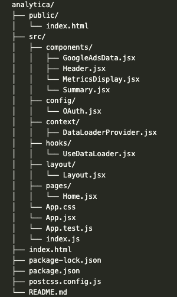

# Interactive Analytics Dashboard

## Introduccion
Este dashboard analítico interactivo proporciona una visión integral del rendimiento de diversas campañas de marketing, combinando datos de Analytics. 
Utilizando React, el dashboard ofrece una interfaz de usuario intuitiva y personalizable que permite a los usuarios explorar los datos de manera visual y extraer insights valiosos.

## Características Clave
- **Visualizaciones interactivas:** Gráficos de barras, líneas y pastel para visualizar métricas clave como impresiones, clics, conversiones, vistas de página, sesiones y demografía.
- **Diseño responsivo:** El dashboard se adapta a diferentes tamaños de pantalla, garantizando una experiencia de usuario óptima en dispositivos de escritorio y móviles.
- **Personalización:** Los usuarios pueden filtrar y segmentar los datos para obtener insights más específicos.
- **Fuente de Datos:** 
  - Google Analytics: Datos simulados proporcionados en un archivo JSON.

## Tecnologías Utilizadas
- **React:** Framework de JavaScript para construir interfaces de usuario.
- **Biblioteca de gráficos:** Chart.js, Recharts, para crear visualizaciones.
- **Biblioteca de estilos:** Tailwind CSS, para diseñar la interfaz de usuario.
- **Axios:** Para realizar las solicitudes a las APIs.
- **Gestor de estado:** Context para manejar el estado de la aplicación.

## Configuración
1. Clonar el repositorio:
   
### `git clone https://[tu_repositorio].git`

2. Instalar dependencias:

### `npm install`

3. Configurar credenciales de API:

- Crear una cuenta de desarrollador en Google Ads API y obtener las credenciales OAuth2.
- Configurar las credenciales en el archivo de configuración de la aplicación.

4. Iniciar el servidor de desarrollo:

### `npm start`

## Estructura del Proyecto

## Consideraciones de Diseño
- **Esquema de color:** Se utilizó una paleta de colores pasteles para crear conrastes a la combinacio y lograr una estetica agradable a la vista.
- **Tipografía:** Se seleccionaron fuentes basicas para mejorar la legibilidad y la jerarquía visual.
- **Diseño responsivo:** Se utilizó Tailwind y para las graficas Chart.js, y Recharts, para garantizar que el dashboard se adapte a diferentes tamaños de pantalla.

## Deployment
https://inter-analytica-dash.vercel.app/

## Despliegue en Vercel

### Preparación Local:

- Asegúrate de tener instalado:
Node.js y npm (o yarn)
Vercel CLI: `npm install -g vercel`
- Verifica el archivo package.json:
Asegúrate de que las dependencias estén actualizadas y que los scripts de build y start estén correctamente configurados.
- Crea un .vercel:
Este archivo (si no existe) contiene la configuración específica para Vercel, como el framework utilizado, el directorio de salida y otras opciones.

### Inicialización de Vercel (si es necesario):

En la terminal, dentro del directorio de tu proyecto: `vercel`
- Sigue las instrucciones de Vercel para vincular tu proyecto a un proyecto existente o crear uno nuevo.
  
### Configuración de Variables de Entorno:
- Vercel Dashboard:
  - Accede a tu proyecto en el dashboard de Vercel.
  - Busca la sección de "Variables de entorno".
  - Verifica que las variables de entorno existentes sean correctas y estén configuradas para el entorno de producción.
  - Añade cualquier variable de entorno nueva que sea necesaria para tu aplicación.
  
### Despligue
- Despliegue inicial `vercel`
- Despliegue posteriores `vercel --prod`
- Despliegue automático:
Configura un despliegue automático en Vercel para que cada push a tu repositorio principal genere un nuevo despliegue.

